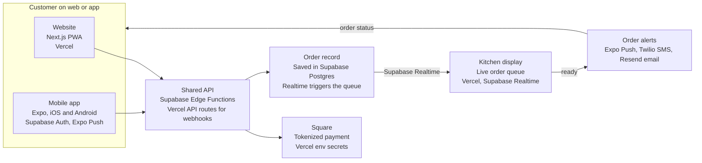
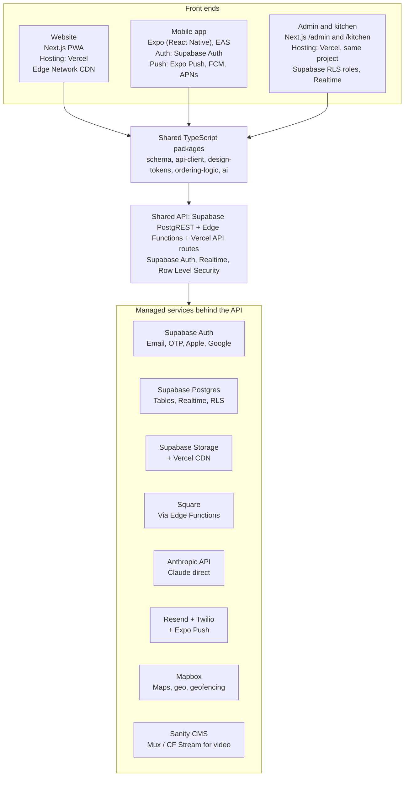

# Tropical Snow: Web + Mobile Architecture Overview

Date: 2026-10-08 (updated from original 2026-10-07 to reflect Supabase + Vercel decision)

Companion to `requirements.md`. Requirement IDs (FR-x, AI-x) and section numbers refer to that document.

---

## The big picture

One shared platform serves three surfaces, and customers can order on either the website or the app. Both read and write the same menu, orders, accounts, events and content, so only the screens differ. This matches the requirements doc: section 4.1 scopes an ordering website plus native apps on one "shared backend platform," and section 10 names that as the guiding principle.

| Surface | Built with | Services | Who uses it | Role |
| --- | --- | --- | --- | --- |
| Website (PWA) | Next.js | Vercel (managed Next.js SSR + Edge CDN); Supabase Auth; Mapbox | Anyone with a browser, including guests | Marketing, live menu, events, full ordering and checkout |
| Mobile app | Expo (React Native) | Calls the shared API (Supabase, Postgres, Storage); Expo Push to APNs and FCM | Repeat customers like Marcus | Same ordering, plus push, wallet, one-tap re-order, geo-alerts, AR |
| Back office | Next.js `/admin` and `/kitchen` | Same Vercel project as the website; Supabase RLS for owner and staff roles; Supabase Realtime for the live queue | Earnest, Sharon, event staff | Menu, prices, events, promos, live order queue |

Rule of thumb: data and business logic are built once and shared. Screens and device features are built per channel.

---

## Overlap map: shared vs. channel-specific

Most of the product is shared. The core ordering flow (menu, customize, pay, pickup, status) is one backend capability with two front ends, while a short list of features is app-first or web-only.

### Built once, used by both channels

| Capability | Requirement IDs | Shared source of truth | Services | Per-channel work |
| --- | --- | --- | --- | --- |
| Accounts, login, guest checkout | FR-1 to FR-5 | Supabase Auth | Supabase Auth (Apple and Google sign-in, phone OTP, anonymous guest sessions); RLS for role-based access | Login screens |
| Menu, customization, allergens | FR-6 to FR-8 | One catalog (CMS + Supabase Postgres) | Supabase Postgres, Supabase Storage, Vercel CDN | Menu and customizer UI |
| Cart, tax, fees, promos, rewards | FR-12, FR-16 | Shared `ordering-logic` package + API | Supabase Edge Functions, Supabase Postgres | Cart and checkout UI |
| Pickup event and time window | FR-13 to FR-15 | Events table + wait-time service | Supabase Postgres, Edge Functions | Picker UI |
| Payment and receipts | FR-21, FR-24 | Square (tokenized) | Vercel API routes for Square webhooks; Vercel env vars for secrets; Resend for receipts | Square Web Payments SDK on web, In-App Payments SDK in app |
| Order status and QR pickup code | FR-17, FR-18 | Supabase Realtime order subscription | Supabase Realtime, Supabase Postgres | Status screen |
| Loyalty, gift cards, balance | FR-22, FR-25, FR-26 | Square Loyalty and Gift Cards | Supabase Edge Functions, Supabase Postgres to mirror Square data | Rewards screens |
| Live events and map | FR-29 | Events table | Supabase Postgres, Edge Functions, Mapbox | Map component |
| Catering request | FR-20 | Request form API | Supabase Edge Functions, Postgres, Resend | Form UI |
| AI assistant, recommendations, support bot | AI-1 to AI-3 | One Anthropic API service with shared guardrails in code | Anthropic API (Claude) called from Supabase Edge Functions | Chat UI |
| Editorial content and promos | FR-10, FR-27 | Sanity CMS | Supabase Storage, Vercel CDN, Mux or Cloudflare Stream for video | Block renderers |

### Different by channel

| Capability | Website | App | Why | Services |
| --- | --- | --- | --- | --- |
| Push notifications (FR-17, FR-27) | Web push through the installed PWA, limited on iOS | Native push (APNs/FCM) | OS support differs | Expo Push notification service for APNs and FCM; web push via service worker |
| Geo-alerts (FR-30) | Not supported | Background geofencing | Needs native location access | Mapbox geofencing + Expo Location/Geofencing APIs |
| AR flavor preview (Phase 4) | `model-viewer` 3D | ARKit/ARCore | Different runtimes, same 3D assets | Supabase Storage + Vercel CDN for GLB and USDZ files |
| Voice ordering (AI-1) | Optional later | App-first | Native speech access | Anthropic API; device speech-to-text for transcription |
| Offline cart (9.1) | Service worker cache | Local storage and queued sync | Festival connectivity | Supabase client retry logic; idempotency keys on all mutations |
| SEO, structured data (9.5) | Core requirement | Not applicable | Search discovery is web only | Vercel (SSR), Next.js metadata API |
| Install and updates | None (PWA optional) | App Store and Google Play review | Store rules | Vercel for web; EAS for store builds |

The second table is why this doc treats "same data" and "same features" as different claims.

---

## How the channels work in tandem

A website order and an app order take the same path, and only the customer's screen and the type of notification differ.

Both channels send the order to one API. The API charges the card through Square, saves the order, and pushes it to the kitchen display in real time via Supabase Realtime. When staff mark it ready, one alert service notifies the customer on the channel they used (FR-12 to FR-18, FR-34).

### Festival connectivity (section 9.1)

- Both channels keep an offline cart and queue changes until the signal returns.
- Every order carries an idempotency key, so a retry never creates a duplicate.
- If the AI service is down, ordering still works.

---

## Content architecture: one interface for both channels

Sanity is the single place the owners edit, and the website and app both read from it through the same API. Not everything is "content," so the owners' interface covers three kinds of data.

| Data kind | Examples | Lives in | Services | How often it changes |
| --- | --- | --- | --- | --- |
| Editorial content | Hero video, brand story, flavor panels, promo banners, FAQs, home layout | Sanity CMS | Supabase Storage, Vercel CDN; Mux or Cloudflare Stream for video | Weekly to monthly |
| Catalog and events | Menu items, photos, prices, customization options, event schedule | Sanity CMS, synced to Supabase Postgres and Square | Supabase Postgres, Edge Function sync jobs, Supabase Storage | Daily to weekly |
| Live operational state | Sold-out toggles, order queue, wait times | Supabase Postgres + Realtime, not the CMS | Supabase Postgres, Supabase Realtime, Edge Functions | Minute by minute |

Live state stays out of the CMS because publish workflows and caching are the wrong tool for "we just ran out of shrimp." That toggle belongs on the kitchen display (FR-8, FR-34). The owners still see everything in one admin.

### How each channel consumes it

- **Shared content model.** Every content type carries a channel field (web, app, or both) and start and end dates, so a promo can be app-only or timed to one event.
- **Website freshness.** A Sanity publish webhook calls a Vercel revalidation endpoint, so pages update in seconds without a rebuild.
- **App freshness.** The app fetches with stale-while-revalidate and caches for offline use, so content changes never need an App Store release.
- **Block-based screens.** Sanity composes pages from a fixed set of blocks (hero, banner, carousel, featured item, event card, promo strip). Web and app each render those blocks natively, so the owners can rearrange the app home screen without a developer.
- **One media library.** One upload to Supabase Storage serves the website, app and social, with images delivered over the Vercel CDN and video through Mux or Cloudflare Stream (FR-10, section 8.2).
- **Campaigns.** A published event can trigger push, SMS and email from the same interface (FR-27).

### CMS options

| Option | Best when | Tradeoff |
| --- | --- | --- |
| Sanity (recommended) | Speed and editor experience matter most | Third-party SaaS; excellent Next.js and Expo integrations |
| Payload CMS (self-hosted) | Full ownership of the CMS is required | You operate it on a server or container |
| Custom `/admin` over Supabase Postgres | Owner workflows are very specific | You build and maintain the editing UX |

The CMS sits behind the shared API client, so swapping one option for another does not change the website or app.

---

## Tech stack: what powers what

One API and one set of shared packages sit under all three front ends, and every service behind the API is shared.

Because web, app and back office all call the same API, a menu change or a new event shows up everywhere at once.

### Stack by layer

| Layer | Choice | Powers |
| --- | --- | --- |
| Website | Next.js (App Router, TypeScript), PWA, hosted on Vercel | SEO, structured data, fast mobile load (9.1, 9.5) |
| Mobile app | Expo (React Native) with Expo Router, EAS Build and over-the-air updates | iOS and Android from one codebase |
| Back office | Next.js `/admin` and `/kitchen`, installable as a tablet PWA | FR-32 to FR-36 |
| API | Supabase PostgREST (auto-generated) + Edge Functions; Vercel API routes for Square webhooks | Real-time order status (FR-17, FR-34) |
| Auth | Supabase Auth with Row Level Security | FR-1 to FR-3 |
| Data | Supabase Postgres for orders, menu, events, loyalty; Supabase Storage for media | FR-8, FR-35, scalability (9.2) |
| Payments | Square (Stripe is the alternative) | FR-21 to FR-25 |
| Messaging | Resend (email), Twilio (SMS), Expo Push + FCM/APNs (push) | FR-17, FR-27 |
| Maps | Mapbox | FR-29, FR-30 |
| Media and content | Supabase Storage, Vercel CDN, Mux or Cloudflare Stream for video, Sanity CMS | Section 8.2, FR-10 |
| AI | Anthropic API (Claude) called from Supabase Edge Functions | AI-1 to AI-8 |
| Infrastructure and CI/CD | Supabase CLI, Vercel CLI, GitHub Actions, EAS | Safe releases |
| Observability | Sentry, PostHog | Section 12 KPIs |

### Where the website is hosted

The website is hosted on Vercel. Vercel is the reference platform for Next.js: it handles SSR, on-demand revalidation (triggered by Sanity webhooks), Edge Network CDN, and a preview URL per pull request with zero config.

| Option | How it works | Choose it when |
| --- | --- | --- |
| Vercel (chosen) | Managed Next.js hosting; builds from Git, runs server rendering, CDN by default; preview URL per PR | Easiest and fastest for a Next.js monorepo; native framework support; suits a small team |
| Cloudflare Pages + Workers | Static and edge-rendered pages on Cloudflare's global network | If CDN egress costs become a concern at scale, or if R2 storage is already in use |
| Self-hosted on Fly.io or Railway | Next.js in a container with a persistent server | Full control over compute; more ops overhead |

### Shared packages in the monorepo

| Package | Contains | Used by |
| --- | --- | --- |
| `schema` | Zod types for Order, MenuItem, Event and the rest | Web, app, back office, API |
| `api-client` | Typed Supabase calls and TanStack Query hooks | Web, app, back office |
| `design-tokens` | Navy, ice-cyan and coral palette, spacing, type | Web, app |
| `ordering-logic` | Cart math, tax, customization rules, ready-time display | Web, app |
| `ai` | Assistant tool definitions and prompts | API and clients |

React Native cannot reuse web UI components one-to-one unless you adopt Tamagui or NativeWind. This plan shares tokens, logic and data hooks and builds the UI per platform, which keeps each channel feeling native.

---

## Phasing with a shared stack

The requirements doc (section 14) puts the website in Phase 1 and the apps in Phase 3. With one shared backend, the phases stay the same but the work inside them shifts earlier, so the apps in Phase 3 become mostly UI work.

| Phase | In the requirements doc | What the shared stack adds |
| --- | --- | --- |
| 1. Foundation | Website, brand and media system, menu, live events, backend, owner CMS | Also build Supabase Auth, the API, and the shared schema, design-token and API-client packages, even though only the website uses them yet |
| 2. Order and Pay | Cart, payments, pickup scheduling, order status, kitchen queue, loyalty v1 | Web ordering ships first. The ordering logic is written once in a shared package the app will reuse |
| 3. Native apps | iOS and Android with order-ahead, push, wallet, re-order, geo-alerts | Expo app consumes the existing API and packages. New work is native screens, Expo Push and Mapbox geofencing, and store review |
| 4. AI and advanced | Conversational ordering, recommendations, support bot, wait-time prediction, AR, Spanish | One Anthropic API service powers both channels. AR is the first feature needing native modules |
| 5. Optimize | Analytics-driven improvements, campaigns, delivery-marketplace exploration | Shared PostHog analytics cover both channels in one funnel |

---

## Key decisions and open questions

| Decision | Recommendation | Why | Alternative |
| --- | --- | --- | --- |
| Payments | Square | Vendor POS, tap-to-pay at the window, and built-in loyalty and gift cards could turn several FR items from custom builds into configuration | Stripe: more flexible, but loyalty and wallet are custom builds |
| Backend platform | Supabase + Vercel | Postgres, auth, realtime and storage in one platform; Vercel for the fastest Next.js deploys; minimal ops overhead for a small team | Firebase: strong push/mobile story but awkward relational queries; AWS: more depth but much more overhead |
| Mobile framework | React Native with Expo | Shares TypeScript, types and data hooks with the Next.js site | Flutter: strong, but shares nothing with the website |
| Menu source of truth | Supabase Postgres for option logic, synced to Square for payment | Handles shave ice combos and customization rules; Postgres SQL is better for reporting (FR-35) than a document store | Square Catalog as the source: simpler for the owners, less flexible for complex customization |
| Messaging | Resend + Twilio + Expo Push | Best-in-class dedicated providers; no single-vendor lock-in; Expo Push handles APNs and FCM registration in one call | Courier: unified API over multiple channels, adds an abstraction layer |

### Questions to confirm with Earnest and Sharon

- [ ] Should web ordering match app ordering at launch, or start as a lighter version? The requirements are silent. This doc assumes parity on the core flow.
- [ ] Do they already use Square or another point-of-sale system at events?
- [ ] Who edits content day to day: the owners only, or event staff too? This affects how Sanity roles and access are configured.
- [ ] Is web push on the installed PWA good enough for order status, or must every notification go through the native app?
