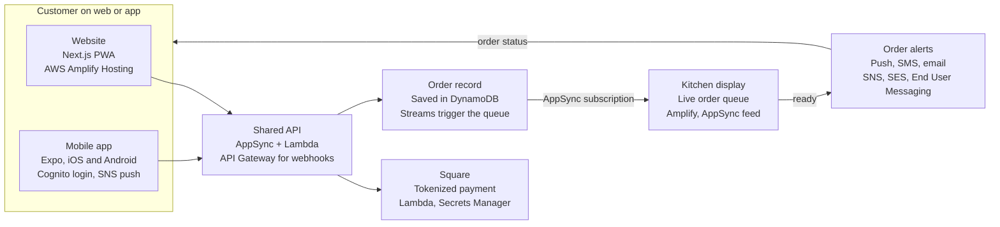
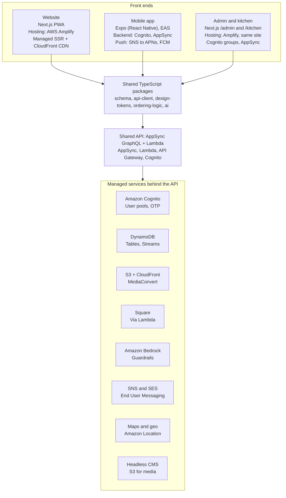

# Tropical Snow: Web + Mobile Architecture Overview

Date: 2026-10-07

Companion to `requirements.md`. Requirement IDs (FR-x, AI-x) and section numbers refer to that document.

---

## The big picture

One shared platform serves three surfaces, and customers can order on either the website or the app. Both read and write the same menu, orders, accounts, events and content, so only the screens differ. This matches the requirements doc: section 4.1 scopes an ordering website plus native apps on one "shared backend platform," and section 10 names that as the guiding principle.

| Surface | Built with | AWS services | Who uses it | Role |
| --- | --- | --- | --- | --- |
| Website (PWA) | Next.js | AWS Amplify Hosting (managed Next.js server rendering, with CloudFront and S3 included), Route 53, WAF | Anyone with a browser, including guests | Marketing, live menu, events, full ordering and checkout |
| Mobile app | Expo (React Native) | Calls the shared API (AppSync, Cognito, S3 and CloudFront); push through SNS to APNs and FCM | Repeat customers like Marcus | Same ordering, plus push, wallet, one-tap re-order, geo-alerts, AR |
| Back office | Next.js `/admin` and `/kitchen` | Same hosting as the website; Cognito groups for owner and staff roles; AppSync subscriptions for the live queue | Earnest, Sharon, event staff | Menu, prices, events, promos, live order queue |

Rule of thumb: data and business logic are built once and shared. Screens and device features are built per channel.

---

## Overlap map: shared vs. channel-specific

Most of the product is shared. The core ordering flow (menu, customize, pay, pickup, status) is one backend capability with two front ends, while a short list of features is app-first or web-only.

### Built once, used by both channels

| Capability | Requirement IDs | Shared source of truth | AWS services | Per-channel work |
| --- | --- | --- | --- | --- |
| Accounts, login, guest checkout | FR-1 to FR-5 | Cognito user pool | Amazon Cognito (Apple and Google sign-in, phone OTP, guest identities) | Login screens |
| Menu, customization, allergens | FR-6 to FR-8 | One catalog (CMS + DynamoDB) | DynamoDB, S3, CloudFront | Menu and customizer UI |
| Cart, tax, fees, promos, rewards | FR-12, FR-16 | Shared `ordering-logic` package + API | AppSync, Lambda, DynamoDB | Cart and checkout UI |
| Pickup event and time window | FR-13 to FR-15 | Events table + wait-time service | DynamoDB, Lambda | Picker UI |
| Payment and receipts | FR-21, FR-24 | Square (tokenized) | Lambda and API Gateway for Square calls and webhooks, Secrets Manager, SES for receipts | Square Web Payments SDK on web, In-App Payments SDK in app |
| Order status and QR pickup code | FR-17, FR-18 | AppSync order subscription | AppSync, DynamoDB Streams, Lambda | Status screen |
| Loyalty, gift cards, balance | FR-22, FR-25, FR-26 | Square Loyalty and Gift Cards | Lambda and DynamoDB to mirror Square data | Rewards screens |
| Live events and map | FR-29 | Events table | DynamoDB, Lambda, Amazon Location Service (or Mapbox) | Map component |
| Catering request | FR-20 | Request form API | AppSync, Lambda, DynamoDB, SES | Form UI |
| AI assistant, recommendations, support bot | AI-1 to AI-3 | One Bedrock service with shared guardrails | Amazon Bedrock with Guardrails and Knowledge Bases, Lambda | Chat UI |
| Editorial content and promos | FR-10, FR-27 | Headless CMS | S3, CloudFront, MediaConvert (CMS is Sanity or Payload) | Block renderers |

### Different by channel

| Capability | Website | App | Why | AWS services |
| --- | --- | --- | --- | --- |
| Push notifications (FR-17, FR-27) | Web push through the installed PWA, limited on iOS | Native push (APNs/FCM) | OS support differs | SNS for APNs and FCM, Lambda for web push |
| Geo-alerts (FR-30) | Not supported | Background geofencing | Needs native location access | Amazon Location geofences, EventBridge, SNS |
| AR flavor preview (Phase 4) | `model-viewer` 3D | ARKit/ARCore | Different runtimes, same 3D assets | S3 and CloudFront for GLB and USDZ files |
| Voice ordering (AI-1) | Optional later | App-first | Native speech access | Bedrock, plus Amazon Transcribe if server-side speech is needed |
| Offline cart (9.1) | Service worker cache | Local storage and queued sync | Festival connectivity | AppSync, Lambda, DynamoDB idempotency table |
| SEO, structured data (9.5) | Core requirement | Not applicable | Search discovery is web only | AWS Amplify Hosting (SSR), Route 53 |
| Install and updates | None (PWA optional) | App Store and Google Play review | Store rules | Amplify Hosting for web; none for store builds |

The second table is why this doc treats "same data" and "same features" as different claims.

---

## How the channels work in tandem

A website order and an app order take the same path, and only the customer's screen and the type of notification differ.

Both channels send the order to one API. The API charges the card through Square, saves the order, and pushes it to the kitchen display in real time. When staff mark it ready, one alert service notifies the customer on the channel they used (FR-12 to FR-18, FR-34).

### Festival connectivity (section 9.1)

- Both channels keep an offline cart and queue changes until the signal returns.
- Every order carries an idempotency key, so a retry never creates a duplicate.
- If the AI service is down, ordering still works.

---

## Content architecture: one interface for both channels

A headless CMS is the single place the owners edit, and the website and app both read from it through the same API. Not everything is "content," so the owners' interface covers three kinds of data.

| Data kind | Examples | Lives in | AWS services | How often it changes |
| --- | --- | --- | --- | --- |
| Editorial content | Hero video, brand story, flavor panels, promo banners, FAQs, home layout | Headless CMS | S3, CloudFront, MediaConvert; Payload would add Lambda or ECS and Aurora | Weekly to monthly |
| Catalog and events | Menu items, photos, prices, customization options, event schedule | CMS, synced to DynamoDB and Square | DynamoDB, Lambda sync jobs, S3 | Daily to weekly |
| Live operational state | Sold-out toggles, order queue, wait times | DynamoDB + AppSync, not the CMS | DynamoDB, AppSync, Lambda | Minute by minute |

Live state stays out of the CMS because publish workflows and caching are the wrong tool for "we just ran out of shrimp." That toggle belongs on the kitchen display (FR-8, FR-34). The owners still see everything in one admin.

### How each channel consumes it

- **Shared content model.** Every content type carries a channel field (web, app, or both) and start and end dates, so a promo can be app-only or timed to one event.
- **Website freshness.** A CMS publish webhook triggers on-demand revalidation in Next.js, so pages update in seconds without a rebuild.
- **App freshness.** The app fetches with stale-while-revalidate and caches for offline use, so content changes never need an App Store release.
- **Block-based screens.** The CMS composes pages from a fixed set of blocks (hero, banner, carousel, featured item, event card, promo strip). Web and app each render those blocks natively, so the owners can rearrange the app home screen without a developer.
- **One media library.** One upload to S3 and CloudFront serves the website, app and social, with video through MediaConvert (FR-10, section 8.2).
- **Campaigns.** A published event can trigger push, SMS and email from the same interface (FR-27).

### CMS options

| Option | Best when | Tradeoff |
| --- | --- | --- |
| Sanity (recommended) | Speed and editor experience matter most | Third-party SaaS outside AWS |
| Payload CMS on AWS | Everything must stay inside AWS | You operate it |
| Custom `/admin` over DynamoDB | Owner workflows are very specific | You build and maintain the editing UX |

The CMS sits behind the shared API client, so swapping one option for another does not change the website or app.

---

## Tech stack: what powers what

One API and one set of shared packages sit under all three front ends, and every service behind the API is shared. The stack stays on AWS, with Square for payments and a headless CMS for content.

Because web, app and back office all call the same API, a menu change or a new event shows up everywhere at once.

### Stack by layer

| Layer | Choice | Powers |
| --- | --- | --- |
| Website | Next.js (App Router, TypeScript), PWA, hosted on AWS Amplify Hosting | SEO, structured data, fast mobile load (9.1, 9.5) |
| Mobile app | Expo (React Native) with Expo Router, EAS Build and over-the-air updates | iOS and Android from one codebase |
| Back office | Next.js `/admin` and `/kitchen`, installable as a tablet PWA | FR-32 to FR-36 |
| API | AppSync GraphQL and Lambda, with API Gateway for webhooks | Real-time order status (FR-17, FR-34) |
| Auth | Amazon Cognito | FR-1 to FR-3 |
| Data | DynamoDB for orders, menu, events, loyalty; S3 and Athena for reporting | FR-8, FR-35, scalability (9.2) |
| Payments | Square (Stripe is the alternative) | FR-21 to FR-25 |
| Messaging | SNS, SES, AWS End User Messaging | FR-17, FR-27 |
| Maps | Mapbox or Amazon Location Service | FR-29, FR-30 |
| Media and content | S3, CloudFront, MediaConvert, plus Sanity or Payload CMS | Section 8.2, FR-10 |
| AI | Amazon Bedrock with Guardrails and Knowledge Bases | AI-1 to AI-8 |
| Infrastructure and CI/CD | SST or CDK, GitHub Actions, EAS | Safe releases |
| Observability | CloudWatch, Sentry, PostHog | Section 12 KPIs |

### Where the website is hosted

The website is hosted on AWS Amplify Hosting. S3 alone is not enough, and CloudFront is the CDN in front of the host rather than the host itself. S3 can only serve a static export, which cannot do server rendering, on-demand revalidation when the CMS publishes, or a live ordering flow. Amplify Hosting supplies the compute layer for Next.js and sets up S3 and CloudFront behind it, so nothing has to be wired by hand.

| Option | How it works | Choose it when |
| --- | --- | --- |
| AWS Amplify Hosting (chosen) | Managed Next.js hosting that builds from Git, runs server rendering, and sets up CloudFront and S3 for you | Easiest to set up and use, with a preview URL for every pull request, which suits a small team |
| Lambda + S3 + CloudFront via SST (OpenNext) | The same pieces deployed in your own AWS account from code | You later want full control, or one deploy covering the website and API |
| ECS Fargate container | Next.js runs as a long-lived server behind a load balancer | Only if serverless limits such as cold starts or timeouts become a problem |

### Shared packages in the monorepo

| Package | Contains | Used by |
| --- | --- | --- |
| `schema` | Zod types for Order, MenuItem, Event and the rest | Web, app, back office, API |
| `api-client` | Typed API calls and TanStack Query hooks | Web, app, back office |
| `design-tokens` | Navy, ice-cyan and coral palette, spacing, type | Web, app |
| `ordering-logic` | Cart math, tax, customization rules, ready-time display | Web, app |
| `ai` | Assistant tool definitions and prompts | API and clients |

React Native cannot reuse web UI components one-to-one unless you adopt Tamagui or NativeWind. This plan shares tokens, logic and data hooks and builds the UI per platform, which keeps each channel feeling native.

---

## Phasing with a shared stack

The requirements doc (section 14) puts the website in Phase 1 and the apps in Phase 3. With one shared backend, the phases stay the same but the work inside them shifts earlier, so the apps in Phase 3 become mostly UI work.

| Phase | In the requirements doc | What the shared stack adds |
| --- | --- | --- |
| 1. Foundation | Website, brand and media system, menu, live events, backend, owner CMS | Also build auth, the API, and the shared schema, design-token and API-client packages, even though only the website uses them yet |
| 2. Order and Pay | Cart, payments, pickup scheduling, order status, kitchen queue, loyalty v1 | Web ordering ships first. The ordering logic is written once in a shared package the app will reuse |
| 3. Native apps | iOS and Android with order-ahead, push, wallet, re-order, geo-alerts | Expo app consumes the existing API and packages. New work is native screens, push and geofencing, and store review |
| 4. AI and advanced | Conversational ordering, recommendations, support bot, wait-time prediction, AR, Spanish | One AI service powers both channels. AR is the first feature needing native modules |
| 5. Optimize | Analytics-driven improvements, campaigns, delivery-marketplace exploration | Shared analytics cover both channels in one funnel |

---

## Key decisions and open questions

Five choices shape scope and cost, and four questions for Earnest and Sharon would settle the rest.

| Decision | Recommendation | Why | Alternative |
| --- | --- | --- | --- |
| Payments | Square | Vendor POS, tap-to-pay at the window, and built-in loyalty and gift cards could turn several FR items from custom builds into configuration | Stripe: more flexible, but loyalty and wallet are custom builds |
| Infrastructure as code | SST or CDK | More control and less lock-in for a client who will keep extending the system | Amplify Gen 2: fastest start for Cognito, AppSync, DynamoDB and S3 |
| Mobile framework | React Native with Expo | Shares TypeScript, types and data hooks with the Next.js site | Flutter: strong, but shares nothing with the website |
| Menu source of truth | DynamoDB for option logic, synced to Square for payment | Handles shave ice combos and customization rules | Square Catalog as the source: simpler for the owners, less flexible |
| Messaging | SNS, SES and AWS End User Messaging | AWS [ends support for Amazon Pinpoint on October 30, 2026](https://docs.aws.amazon.com/pinpoint/); SMS, voice and mobile push APIs continue under End User Messaging | Third-party messaging provider |

### Questions to confirm with Earnest and Sharon

- [ ] Should web ordering match app ordering at launch, or start as a lighter version? The requirements are silent. This doc assumes parity on the core flow.
- [ ] Do they already use Square or another point-of-sale system at events?
- [ ] Who edits content day to day: the owners only, or event staff too? This affects the CMS choice.
- [ ] Is web push on the installed PWA good enough for order status, or must every notification go through the native app?

### If the project moves off AWS

- **Supabase, Vercel and Expo:** fastest to start, with Postgres, auth and realtime built in. Less depth for AI and spike handling.
- **Firebase and Expo:** strong mobile and push story, but NoSQL queries are awkward for reporting.
- **Square-centric lean build:** Square for orders, payments and loyalty with a thin custom layer. Lowest cost, least control over the AI-driven experience.

Staying on AWS remains the recommendation, since nothing in the requirements forces a move.

---

## Sources

- [Amazon Pinpoint end of support notice, AWS documentation](https://docs.aws.amazon.com/pinpoint/)
